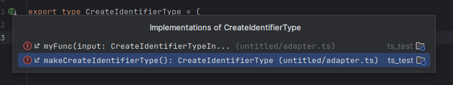

# ts-typed-functions

JetBrains IDE plugin (IntelliJ IDEA Ultimate, WebStorm) for searching TypeScript functions whose signature is defined by a type alias.

## Matching strategy

Matching is **loose** — based on the referenced type-name shape. A function is treated as an implementation of a function-typed alias if its parameter types and return type reference the same named types as the signature.

Example signature:

```ts
export type CreateIdentifierType = (
  input: CreateIdentifierTypeInput,
) => Promise<CreateIdentifierTypeResult>;
```

A function is matched when its signature references `CreateIdentifierTypeInput` as the input type and `Promise<CreateIdentifierTypeResult>` as the return type — even when it does not name `CreateIdentifierType` itself:

```ts
export const createIdentifierTypeImpl = async (
  input: CreateIdentifierTypeInput,
): Promise<CreateIdentifierTypeResult> => { ... };
```

Full TypeScript structural type compatibility (e.g. matching inlined or differently-named-but-compatible types) is out of scope.

## Installation

Build the plugin ZIP from this repo (requires JDK 21):

```sh
cd ts-typed-functions
./gradlew buildPlugin
```

The output lands at `ts-typed-functions/build/distributions/ts-typed-functions-0.2.0.zip`.

In WebStorm (or IntelliJ IDEA Ultimate): **Settings → Plugins → ⚙ → Install Plugin from Disk…**, pick the ZIP, then restart the IDE.

For a sandboxed dev instance with the plugin pre-loaded, run `./gradlew runIde`. By default this launches IntelliJ IDEA Ultimate (`platformType=IU` in `gradle.properties`); change it to `WS` to launch WebStorm instead.

## Usage



A gutter icon appears on the *name* of a function-typed type alias when at least one implementation in the project matches its signature. Clicking the icon shows a popup of matching implementations with their file and line.

A reverse gutter icon appears on implementation function names — top-level `function` declarations and `const`/`let` initializers that are arrow functions or function expressions — when at least one matching signature exists. Clicking it shows a popup of matching signatures.

The action **Find Implementations of Type Signature** runs from the caret on a function-typed alias. Default shortcut: `Ctrl+Alt+Shift+P` (Windows/Linux) or `Cmd+Alt+Shift+P` (macOS). Also accessible via the editor's right-click menu.

Both the gutter and the action also surface **factories** — top-level functions whose explicit return type names the signature alias. For example, `function makeCreateIdentifierType(): CreateIdentifierType { ... }` will appear among the matches for `CreateIdentifierType`, marked `[factory]` in the action's popup. The factory's own parameter shape is not checked; only its declared return type matters.

Matches also include **annotated implementations** — typed `const`/`let` declarations whose type annotation names the signature alias and whose initializer is a function literal. This catches implementations declared inside a repository-style factory:

```ts
export function makeIdentifierTypesRepository(client: typeof db) {
  const findIdentifierTypeByName: FindIdentifierTypeByName = async (name) => {
    // ...
  };
  return { findIdentifierTypeByName };
}
```

The structural matcher would skip this because the arrow function has no parameter or return type annotations of its own. The annotation-based path picks it up via the variable's type annotation. The annotation must be a single, unqualified identifier (no generics, unions, or intersections).

## Result ordering

Matches are ordered by filesystem proximity to the signature: same-directory matches first, then sibling directories, then more distant project files. Library / `node_modules` matches all share the bottom bucket (no internal ordering within that bucket). This keeps generic signatures like `() => string` usable — your project's implementations appear first, third-party noise last.

## Edge cases handled

- Implementations missing a type on any parameter or return type are skipped (no guessed matches).
- `node_modules` is excluded from search.
- Multi-line types, comments, and varied whitespace are normalized — they don't affect matching.
- `async` implementations returning `Promise<T>` match a sync signature declared as returning `Promise<T>`.

## Non-goals (v1 limitations)

- **Renamed imports.** A type imported via `import { Foo as Bar }` and used as `Bar` won't cross-match a signature that uses `Foo`.
- **Generic signatures.** Type aliases that declare type parameters (e.g. `type Handler<T> = (x: T) => void`) are not indexed.
- **Strict TypeScript structural compatibility.** Real assignability checking is out of scope — matching is based on type-name shape, not the TypeScript type system.
- **Class methods.** Only top-level functions and `const`/`let` arrow/function-expression initializers are considered implementations (the annotation-based path additionally covers nested `const`/`let` declarations).

## Architecture

For how the plugin is wired into the IDE — entry point, indexes, line markers, and action flow — see [docs/architecture.md](docs/architecture.md).
